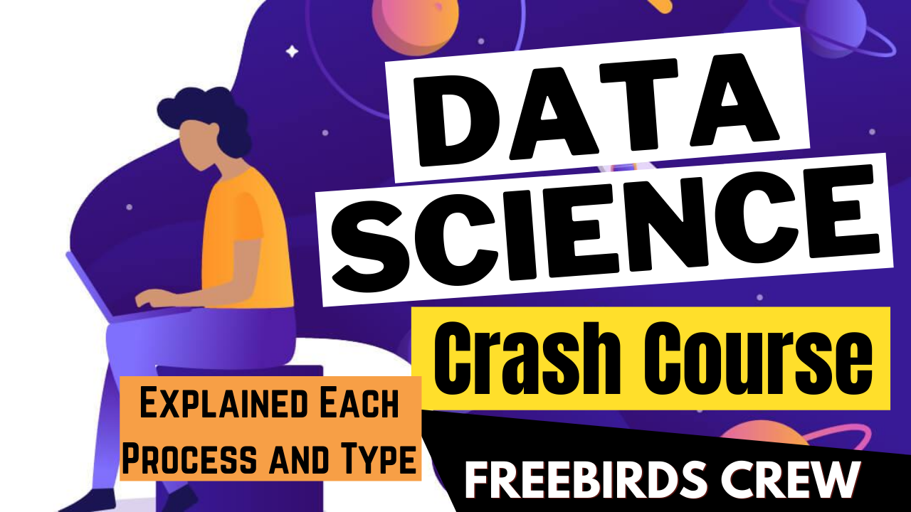

# DataScience_Crash_Course

## 🔴 Data Science Crash Course 🔴

### YouTube Link - http://bit.ly/319NWmz

💡It Contains Data Science from Scratch Tutorial, Explained Each and Every Step of Data Science Cycle or Processes.
In this Video, We Explained - 

1. Data Science 
2. Business Understanding
3. Analytic Approach
4. Data Mining or Extraction of Data
5. Data Cleaning
6. Data Exploration
7. Feature Engineering
8. Predictive Modeling
9. Data Visualization
10. Machine Learning Model on a Data Set that Compares all Machine Learning Models on their Accuracy and Precision.

### 🔴 Algorithms that are in Comparision are - LogisticRegression, LinearDiscriminantAnalysis, KNeighborsClassifier, DecisionTreeClassifier, GaussianNB, SVC (Super Vector Machines).
Explained about Data Visualization that tells about Plotly and Dash.

To get the Source Code, Follow me on 
### Github - https://bit.ly/3gg07Uc

Follow us on Instagram and Telegram to get Updates on Projects and Ideas that We are Working On !!
### Instagram - https://bit.ly/3jLR8vY
### Telegram - https://bit.ly/30bstcE

## 🔴Next Project - Series of Data Structure from Scratch with Python.
The More You Analyze, the More You Get Insights from the Data.
 

Connect with us:

